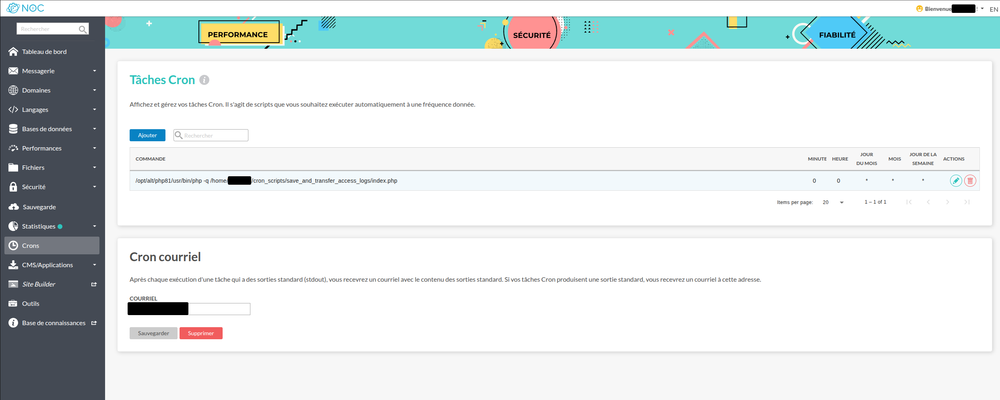
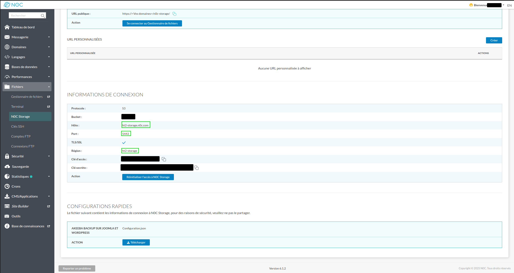

# Save and Transfer N0C Access Logs

A script to save and transfer N0C access logs to N0C Storage.

This script is meant to be run in a cron job once a day to save and transfer logs from the previous day.

## 🚀 Features

- Utilizes PlanetHoster's API to fetch N0C access logs.
- Transforms JSON log data to brute Apache log format.
- Saves logs to account's N0C Storage.

## ⚠️ Limitations

- Only works with N0C hosting accounts.
- Requires valid PlanetHoster API credentials.
- 10 000 log entries limit per timeline.
    - If your logs exceed this limit, consider running the script multiple times a day with adjusted timeframes.
    - See the [Adjusting the Timeframe](#adjusting-the-timeframe) section below for details.

## 🧩 Requirements

[PlanetHoster API credentials (API user and secret)](https://kb.planethoster.com/en/guide/domains-api/)

PHP ≥ 8.1

[Composer ≥ 2.0](https://kb.n0c.com/en/knowledge-base/install-composer-and-phpmailer-on-n0c/)

[AWS SDK for PHP (installed via Composer) — aws/aws-sdk-php: ^3.356](https://github.com/aws/aws-sdk-php)

[PHP dotenv library (installed via Composer) — vlucas/phpdotenv: ^5.6](https://github.com/vlucas/phpdotenv)

## 📦 Installation

Clone the repository

```
git clone https://github.com/PlanetHoster/save_and_transfer_access_logs.git
cd save_and_transfer_access_logs
```

Install dependencies using Composer

`composer install`

Set up configuration (if applicable)

Copy .env.example to .env and update values:

`cp .env.example .env`

## ▶️ Usage

Run the script directly from the command line:

`php index.php`

On N0C (to specify php 8.1):

`/opt/alt/php81/usr/bin/php /home/USERNAME/save_and_transfer_access_logs/index.php`

### 📅 Scheduling with Cron via N0C

To schedule the script to run daily, add a cron job in your N0C hosting account:

1. Log in to your N0C hosting account.
2. Navigate to the "Cron" tab.
3. Add new cron job to run daily with the following command (replace USERNAME with your actual hosting username):

```/opt/alt/php81/usr/bin/php /home/USERNAME/save_and_transfer_access_logs/index.php```



## ⚙️ Configuration

The script uses environment variables for configuration. Below are the required variables:

```
PH_API_KEY PlanetHoster API Secret Key
PH_API_USER PlanetHoster API User Key
HOSTING_USERNAME N0C Hosting Account Username
S3_ENDPOINT N0C Storage endpoint with port (https://hostname:port)
S3_REGION N0C Storage region
```

The `S3_ENDPOINT` and `S3_REGION` can be found in your N0C Storage settings:



## 📝 Adjusting the Timeframe

By default, the script fetches logs from the previous day. To adjust the timeframe, modify the following lines in
`index.php`:

```php
$startDate = (new DateTimeImmutable('yesterday', $utc))->setTime(0, 0, 0)->format('Y-m-d\TH:i:s.000\Z');
$endDate = (new DateTimeImmutable('today', $utc))->setTime(0, 0, 0)->format('Y-m-d\TH:i:s.000\Z');
```

For example, to fetch logs from the last 12 hours, you can change it to:

```php
$startDate = (new DateTimeImmutable('-12 hours', $utc))->format('Y-m-d\TH:i:s.000\Z');
$endDate = (new DateTimeImmutable('now', $utc))->format('Y-m-d\TH:i:s.000\Z');
```

## 🧰 Directory Structure

```
save_and_transfer_access_logs/
├── src/ # Source files
├── vendor/ # Composer dependencies
├── composer.json # Composer configuration
├── composer.lock
├── index.php # Main entry point
├── .env.example # Example environment configuration
├── .php-version # PHP version specification
├── tmp/ # Logs are temporarily saved here before transfer
└── README.md
```

## 🧑‍💻 Contributing

Fork the project

Create a new branch

`git checkout -b feature/new-feature`
`git push origin feature/new-feature`
Commit your changes

`git commit -m 'Add new feature'`

Push to the branch

`git push origin feature-new-feature`

Open a Pull Request

## 📄 License

This project is licensed under the MIT License.

## 🙌 Credits

Developed by Nicholas Bérubé.

Special thanks to any libraries, APIs, or contributors.